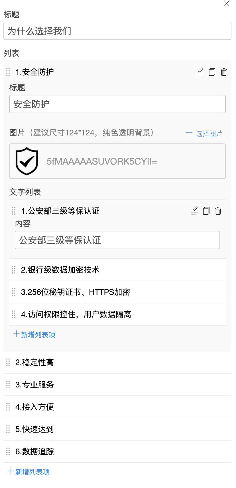

# vue-dove

## 如何使用

### 编辑器

安装

```sh
yarn add vue-dove
```

引入

```js
// main.js 渲染
import Vue from "vue";
import { Components, Editor } from "vue-dove";

import "vue-dove/dist/vue-dove.css";

Vue.use(Editor);

// 如果不使用 vue-dove 预定义的组件，可以不引入和注册
Vue.use(Components);
```

使用

```vue
<template>
  <dove-editor :value="schema" @change="onChange" :components="componentList" :templates="templateList" />
</template>
<script>
// index.vue
// 以下两个是已经定义好的组件列表和模板列表。可以按照里面的定义形式自己定义自己的组件和模板，也可以将自定义的组件混合进来一起使用
// 如果不使用预定义的组件，可以不引入，
import componentList from "vue-dove/packages/components/schema";
import templateList from "vue-dove/packages/template";
export default {
  data() {
    return { schema: [], templateList, componentList };
  },
  methods: {
    onChange(value) {
      console.log(value);
    },
  },
};
</script>
```

自定义请求，由于 cascade, enum、image、file 等编辑器可以通过自定义请求的方式进行数据请求和处理。

需要监听 editor 的 request 请求进行自定义处理；

```vue
<template>
  <dove-editor :value="schema" @request="customRequest" />
</template>
<script>
export default {
  data() {
    return { schema: [] };
  },
  methods: {
    customRequest(options) {
      /**
       * @namespace options
       * @property {from} 来自哪个编辑器，可能的值有 cascade、enum、image、file
       * @property {files} 当 from 为 image、file 时，会有files属性为选择的文件或图片
       * @property {option} 当 from 为 cascade、enum 时，会用 option 属性为自定义的属性内容，可以用于URL或其他用于辨识请求方法的字符串
       * @property {callBack} 请求成功或失败后调用 callBack 将数据返回到编辑器。image、file 类型的直接返回图片或文件的网络地址；cascade, enum 类型的返回选择器能识别的数组。不要直接返回网络请求返回的请求数据体，可能数据格式不满足要求。
       */
    },
  },
};
</script>
```

### 渲染 schema

安装

```sh
yarn add vue-dove
```

引入

```js
// main.js
import Vue from "vue";
import { Components, Viewer } from "vue-dove";

import "vue-dove/dist/vue-dove.css";

Vue.use(Viewer);

// 如果不使用 vue-dove 预定义的组件，可以不引入和注册
Vue.use(Components);
```

使用

```vue
<template>
  <dove-viewer :value="schema" />
</template>
<script>
// index.vue
export default {};
</script>
```

### 自定义主题

```less
@import "vue-dove/packages/styles/index.less";

@primary-color: #8c0776;
```

```less
// less变量
// theme-color
@primary-color: #e03029;

@emphatic-color: #ff9a00;

@text-primary: #303133;
@text-ordinary: #606266;
@text-subsidiary: #909399;
@text-tooltip: #bfc2cc;

@marginal: #e7ebe9;
@background: #f9f9f9;

// view-width 控制宽度和组件自身的padding，
@page-wrapper-width: 1200px;

@block-wrapper-padding: 50px 0;
```

自定义颜色主题只能影响 Components 里面预定义的组件。

## 如何定义一个 schema

为了不增加学习负担，数据格式的定义方式使用 JSON 进行定义，通过增加特定属性前缀`schema-`来表示编辑器使用的属性:

| 属性               | 说明                                                                                                              | 示例                                                                                                |
| ------------------ | ----------------------------------------------------------------------------------------------------------------- | --------------------------------------------------------------------------------------------------- |
| schema-type        | 编辑器类型，其中 object、array 可以相互嵌套形成一个复杂的 schema 形式                                             | object, array,number, boolean,check, text, richtext, textarea, url,cascade, enum, color,image, file |
| schema-title       | 属性标题                                                                                                          |                                                                                                     |
| schema-value       | 属性值，不同 type 对应的值得类型不一样，object 类型没有这个属性，以不带有`schema-`的属性作为遍历解析              |                                                                                                     |
| schema-description | 属性说明                                                                                                          | 比如图片会有尺寸限制和建议，`"建议尺寸124*124，纯色透明背景"`                                       |
| schema-option      | enum、cascade 选择编辑器的选项，可以使数组直接可以进行选择，也可以是 url，通过传递给 request 的函数进行自定义请求 |                                                                                                     |
| schema-max         | array 编辑器数组最大长度限制，数字                                                                                | `4`                                                                                                 |
| schema-min         | array 编辑器数组最小长度限制，数字                                                                                | `2`                                                                                                 |
| schema-show        | array 编辑器项目编辑时，且下级属性为 object 时，可以指定在项目序号这儿显示的 object 属性的内容                    | `"title"`                                                                                           |

### schema-type 说明

| 类型                | 说明                                                                                                                                                                                                                                         |
| ------------------- | -------------------------------------------------------------------------------------------------------------------------------------------------------------------------------------------------------------------------------------------- |
| object              | object 不带有`schema-value`属性，且将不带有`schema-`的属性进行遍历解析，当 `schema-type` 为 `object` 时，可以不用设置 `schema-type`                                                                                                          |
| array               | `schema-value` 为数组                                                                                                                                                                                                                        |
| number              | 数字编辑器                                                                                                                                                                                                                                   |
| boolean             | boolean 编辑器，本质为 check                                                                                                                                                                                                                 |
| check               | check 编辑器，本质为 radio group                                                                                                                                                                                                             |
| text                | 文本编辑器，普通的文本输入框                                                                                                                                                                                                                 |
| textarea            | 文本编辑器，普通的 textarea                                                                                                                                                                                                                  |
| richtext            | 富文本编辑器，使用的是 jodit                                                                                                                                                                                                                 |
| url                 | 链接编辑器，普通文本做了 decodeURI                                                                                                                                                                                                           |
| enum                | select 选择器。接收的`schema-option` 为数组或字符串，如果是字符串需要定义请求去获取数据并调用 callBack 将数据返回给编辑器。 `schema-option` 数据格式为 `[{value:1,label:"男"},{value:2,label:"女"}]`                                         |
| cascade（暂未实现） | 联级选择器。接收的`schema-option` 为数组或字符串，如果是字符串需要定义请求去获取数据并调用 callBack 将数据返回给编辑器。 `schema-option` 数据格式为 `[{value:52,label:"贵州",children:[{value:5201,label:"贵阳"}]},{value:51,label:"四川"}]` |
| color               | 颜色选择器                                                                                                                                                                                                                                   |
| image               | 图片选择器 （需要监听 editor 的 request 函数，用于处理上传逻辑）                                                                                                                                                                             |
| file（暂未实现）    | 文件选择器 （需要监听 editor 的 request 函数，用于处理上传逻辑）                                                                                                                                                                             |

如下例子：

```json
{
  "schema-type": "object",
  "title": {
    "schema-type": "text",
    "schema-title": "标题",
    "schema-value": "为什么选择我们"
  },
  "list": {
    "schema-type": "array",
    "schema-title": "列表",
    "schema-show": "title",
    "schema-value": [
      {
        "schema-type": "object",
        "title": {
          "schema-type": "text",
          "schema-title": "标题",
          "schema-value": "安全防护"
        },
        "image": {
          "schema-type": "image",
          "schema-description": "建议尺寸124*124，纯色透明背景",
          "schema-title": "图片",
          "schema-value": "data:image/png;base64,iVBORw0KGgoA"
        },
        "list": {
          "schema-type": "array",
          "schema-title": "文字列表",
          "schema-value": [
            {
              "schema-type": "text",
              "schema-title": "内容",
              "schema-value": "公安部三级等保认证"
            },
            {
              "schema-type": "text",
              "schema-title": "内容",
              "schema-value": "银行级数据加密技术"
            }
          ]
        }
      },
      {
        "schema-type": "object",
        "title": {
          "schema-type": "text",
          "schema-title": "标题",
          "schema-value": "稳定性高"
        },
        "image": {
          "schema-type": "image",
          "schema-description": "建议尺寸124*124，纯色透明背景",
          "schema-title": "图片",
          "schema-value": "https://www.baidu.com/img/PCfb_5bf082d29588c07f842ccde3f97243ea.png"
        },
        "list": {
          "schema-type": "array",
          "schema-title": "文字列表",
          "schema-value": [
            {
              "schema-type": "text",
              "schema-title": "内容",
              "schema-value": "自研监控系统，数据自动分流"
            },
            {
              "schema-type": "text",
              "schema-title": "内容",
              "schema-value": "支持故障无缝对接"
            }
          ]
        }
      }
    ]
  }
}
```

以上例子最终在编辑器里面解析和编辑的内容如下



以上例子再被解析到渲染组件的时候的内容如下：

```json
{
  "title": "为什么选择我们",
  "list": [
    {
      "title": "安全防护",
      "image": "data:image/png;base64,iVBORw0KGgoA",
      "list": ["公安部三级等保认证", "银行级数据加密技术"]
    },
    {
      "title": "稳定性高",
      "image": "https://www.baidu.com/img/PCfb_5bf082d29588c07f842ccde3f97243ea.png",
      "list": ["自研监控系统，数据自动分流", "支持故障无缝对接"]
    }
  ]
}
```

通过 `v-bind="props"` 将这个解析后的值传递给组件，组件的 props 设定如下

```vue
<script>
export default {
  props: {
    title: String,
    list: Array,
  },
};
</script>
```

## Project command

```sh
yarn install #Project setup
yarn serve #Compiles and hot-reloads for development
yarn build # Compiles and minifies for production
yarn lint # Lints and fixes files
```

## git 提交规范(Angular 规范)

1. feat 新增一个功能
2. fix 修复一个 Bug
3. docs 文档变更
4. style 代码格式（不影响功能，例如空格、分号等格式修正）
5. refactor 代码重构
6. perf 改善性能
7. test 测试
8. build 变更项目构建或外部依赖（例如 scopes: webpack、gulp、npm 等）
9. ci 更改持续集成软件的配置文件和 package 中的 scripts 命令，例如 scopes: Travis, Circle 等
10. chore 变更构建流程或辅助工具
11. revert 代码回退
